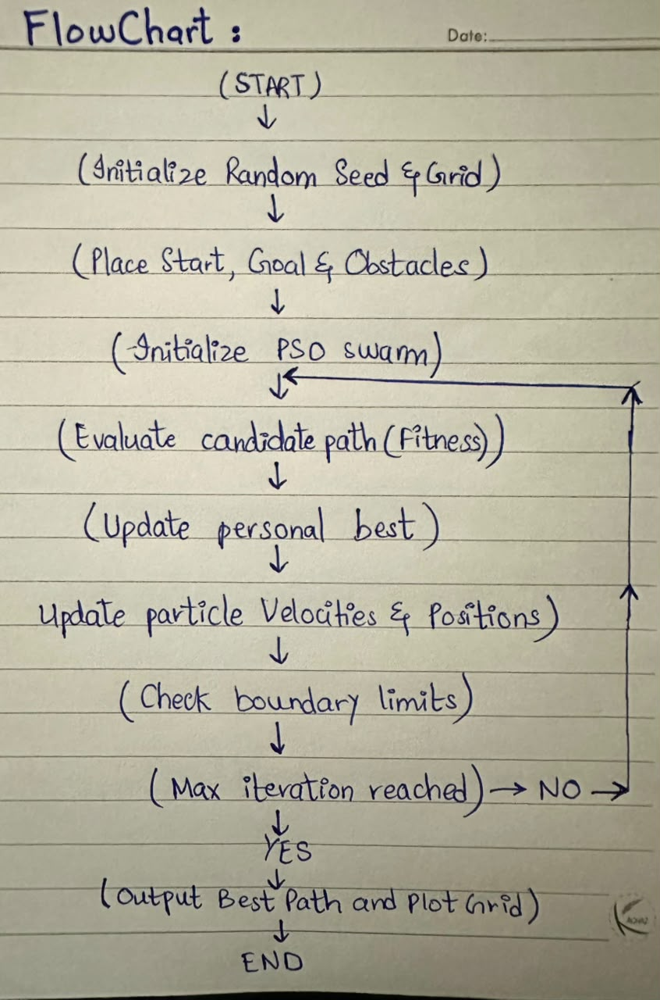

# Swarm-Based Path Planning with Obstacles (PSO)

**Student Name:** Nayab Sajid
**Roll Number:** 01-136232-092
**Random Seed:** 136232

## Project Overview
This project implements Particle Swarm Optimization (PSO) on a 2D grid to navigate from a start node to a goal node while avoiding randomly generated obstacles.

## Algorithm Flow Diagram

